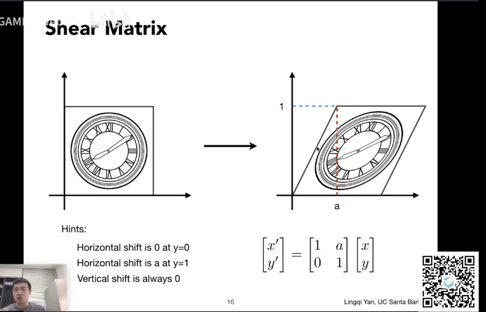
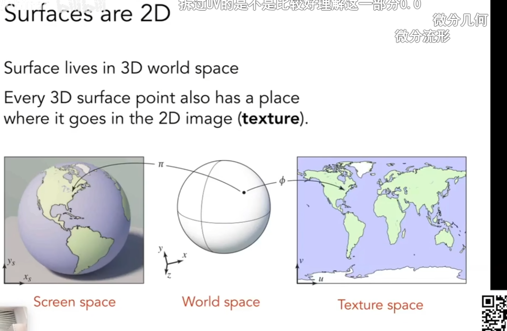
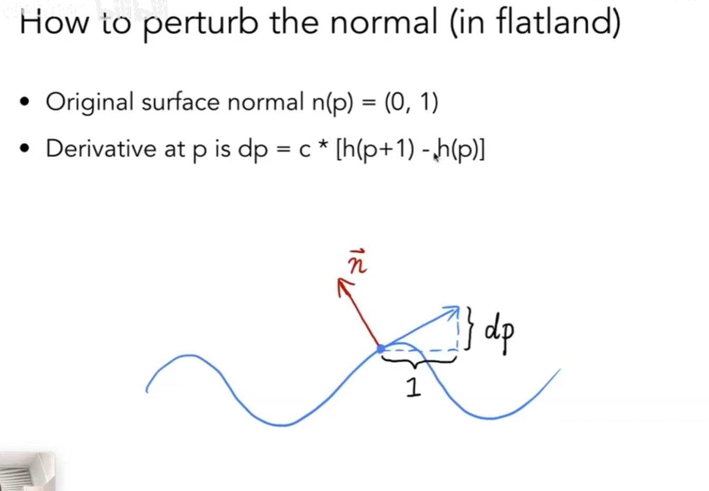
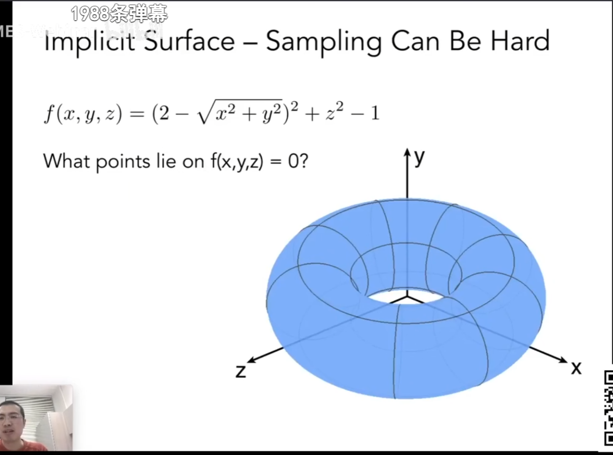
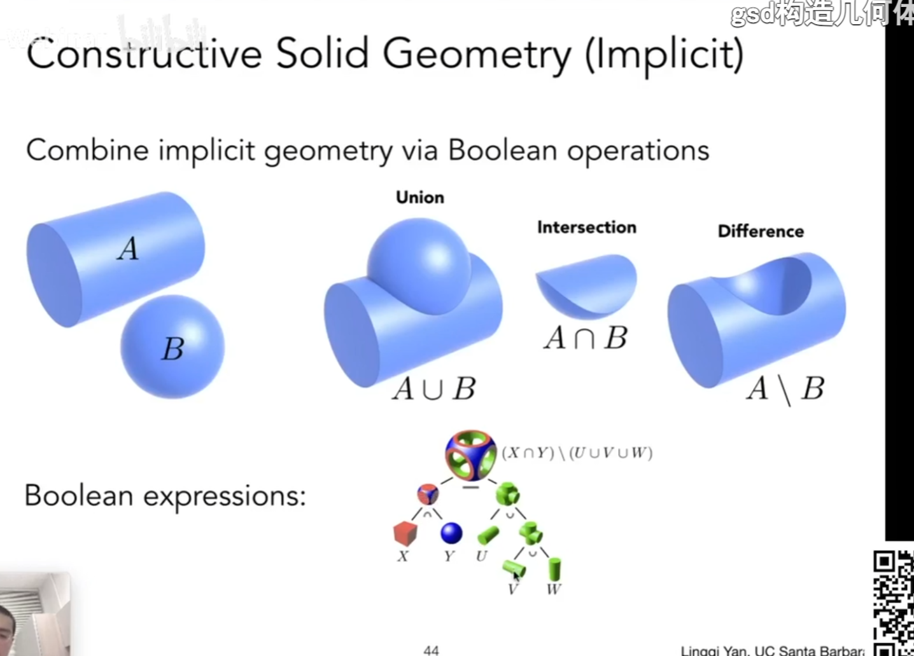
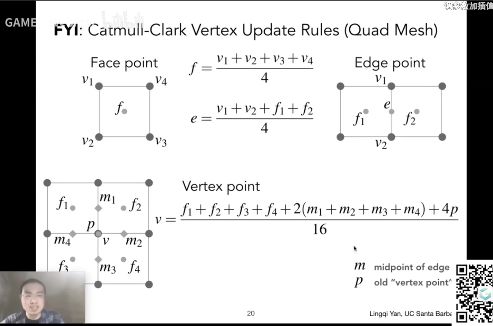
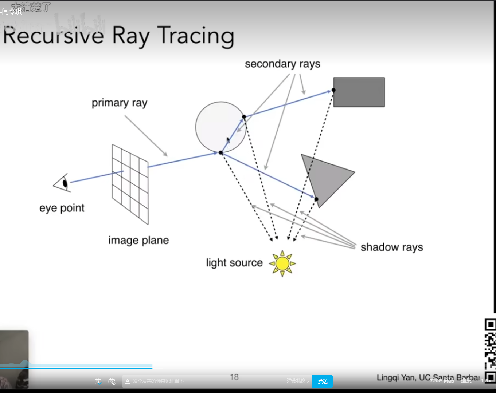
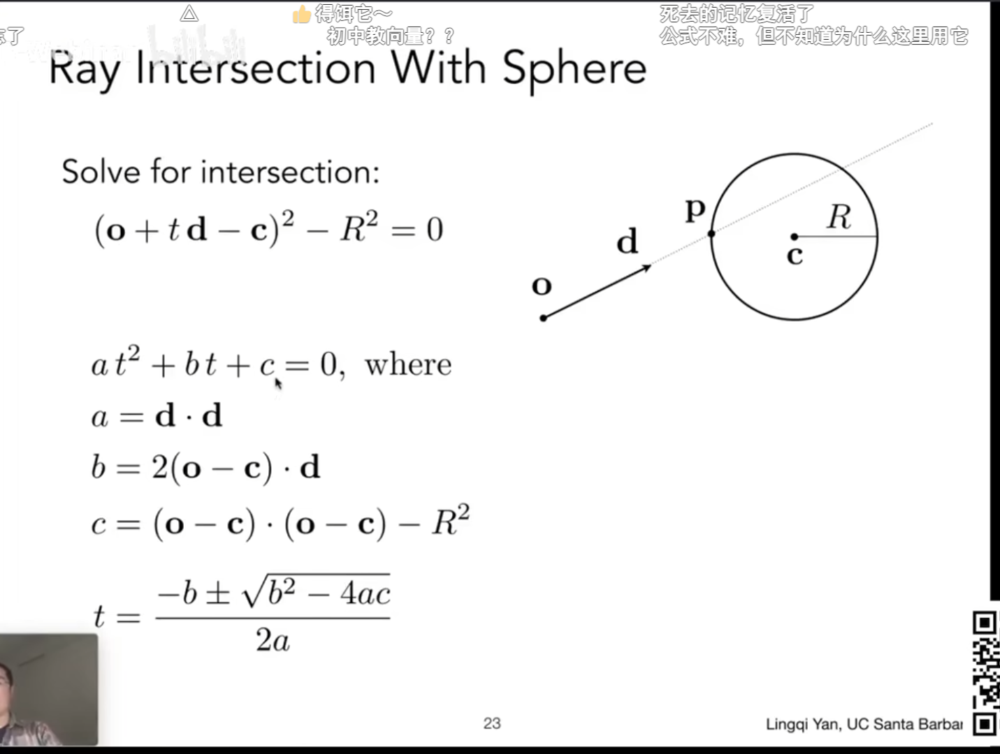

## Transformation

Viewing : 3D to 2D projection

#### Scale


#### Shear 



#### Rotate

默认（0，0） CCW


变换可写成矩阵乘积数据的形式 ==> 线性变换 


 如果需要以统一的方法表示平移


则应该引入齐次化过程。

点的变换添加一个1，向量的变换添加一个0.

（在射线法中，计算射线的方向变换）（计算法向量时，法向量的变换）


 

仿射变换都可以写成齐次坐标的形式


仅在2D下的仿射变换，矩阵最后一行为001（可以在计算时作为常量引入，而不用特意存储）

 矩阵的结合律：变换合成与分解


对于非原点的点的变换操作：先移至原点，变换后再移回去


旋转负角度 是旋转该角度下的旋转矩阵的逆矩阵


在旋转中，旋转矩阵的逆等于旋转矩阵的转置 ==> 正交矩阵

三维变换


3D的旋转  （右手坐标系）

（cosa 在1的右下，以此类推）


正交变换投影：

描述一个长方体，将其中心移动到原点，再将边长拉扯至立方体[-1,1]上。


透视投影：相似三角形原理，处于远近平面中间的点，投影至近平面所需要的xy上的变换。


## 光栅化


将标准平面坐标系中的像素映射到屏幕上：视口变换

z方向不变，即屏幕平面始终朝向相机反向


三角形是最基础的多边形。

三角形内部一定是平面的。

通过向量的叉积定义一个点是否在三角形内。

采样法：使用一个连续的函数，在一个离散的集合中询问该集合元素对应的函数值，得出的值的集合。（将函数离散化的过程）

如：屏幕空间中，不同像素的中心是否在需要渲染的三角形内


Aliasing 走样 锯齿

所以需要反走样，抗锯齿


滤波：去掉特定频率的信息

对于一个特定的图像，变化大的频率高，变化小的频率低。

【高通低通带通】


卷积：对于某个窗口的特定区域的数，进行一系列的规则运算后得到的数写回该区域中（如一维卷积中，对一个数组做大小为三的卷积）


做模糊的两种方案：

对原图像取平均卷积

对原图进行傅里叶变换后，乘以卷积网络的傅里叶变换值，再逆变换回去

（时域的卷积 = 频域的乘积）


box filter  盒子滤波器 （也是低通滤波器） （模糊）

盒子越大 频域图（白色区）越小  ，可以这么理解：因为边界大（多）了。

也可以这么理解：对某块区域做滤波，滤波区越大，滤后平均的范围就越大，就只能留下更低的频率，所以越模糊；而盒子越小，（如用一个像素去滤波，等于没滤）

采样就是在重复频域上的内容

用冲击函数对一块连续区域的函数进行采样，得到一系列的点。 

在频域上解释，就是将一块区域复制粘贴到频域中。


采样率不足时会造成频谱混叠


反走样：先做模糊，再做采样

先进行低通滤波，将高频信息去掉，再进行原来的频率的采样（采样频率不变时）

另一种方案是提高分辨率，即提高采样频率


用一定大小的低通滤波器（即对图像进行卷积。）

用一个像素的box filter进行滤波，对于边界的情况可虑成灰值


抗锯齿效果

用多像素box filter进行时，求覆盖率 MSAA

（模糊操作）


再进行采样


可查  抖动分布采样 分时抗锯齿 

MSAA

FXAA (图像后期处理，得到锯齿的图，找到边界，并替换边界（边缘检测）)

TAA（时间相关，相邻两帧的点，复用上一帧的点进行的操作）


超分辨率

都是解决样本不足的问题

DLSS 


可见度和遮挡问题

画家算法：排序，然后由远及近进行绘制。

会存在循环覆盖问题


深度缓冲

Z-Buffer

对每个像素存一个深度缓存。

在渲染时，同时生成深度缓存。同步生成。


先认为所有像素的深度无限远，然后对任意三角形覆盖的所有像素与深度缓存中对应的值进行比较，取小更新，并在渲染区绘制。


深度缓存算法跟顺序无关

对MSAA的结果做深度缓存。

Z-Buffer对透明物体处理不了，需要进行特殊处理。


着色 Shadding

漫反射：接受到的能量 跟  法线方向与光线方向的夹角余弦有关


 光强与距离相关，在同距离处的光的能量相同，但由于周长原因，强度越来越小。


最终漫反射的公式如下：


kd表示为一个Color，跟物体贴图颜色相关，就可以定义漫反射的颜色。

漫反射跟观察角度无关，与物体面的方向相关。


高光


当v和R接近时，n和h一定接近。

使用点乘来判断

镜面反射系数一般为白色，用夹角余弦的指数来生成高光（高光性质）。


环境光

该模型下，从环境射进摄像机的值，保证所有地方都能看到，是一个常数。

更细致的，需要考虑全局光照。


bling -feng 模型是经验模型。


着色细分

Flat shading 使用每个三角面同向法，三角形各顶点颜色一致，内部无颜色变化


Gouraud Shading

三角形每个顶点有颜色，在内部对这个三角形的颜色做插值。


Phong shading 

逐像素着色


逐顶点的法线：顶点的法线为它所被共面的法线的平均（简单平均、加权平均都可）。


逐像素的法线：（与重心坐标相关，从一个顶点到另一个顶点的法线方向平均变化）


///====

着色器练习


///====


纹理映射

对于漫反射中的kd。可以通过漫反射映射出去。

三维物体的表面是二维的，可以与一个图有一一对应的关系。



纹理坐标：u-v,范围[0,1]


在三角形内部进行插值

引入重心坐标

在知道顶点的情况下，知道三角形内任意一点的值。

点在三角形内，必须要α等都非负。


可从面积比求出任意点坐标的重心坐标系数


重心坐标不具有投影不变性，所以应先做三维插值，再投影。


需要解决的问题

纹理放大：当纹理过小，像素映射到纹理图的一个非整数区域时，可能会出现多块物体表面像素映射同一个纹理像素的情况。

双线性插值

针对映射的像素位置选定需要纳入插值的纹理像素区


在水平上进行插值


再在竖直上进行插值


最邻近-双线性（周围4个）-立方插值（周围16个）


纹理过大时，远处出现摩尔纹，近处出现锯齿 ==> 出现了走样

像素覆盖的纹理区域：


点查询问题和范围查询问题

一种好方法是直接对该区域进行均值。

Mipmap  也称图像金字塔


近似，正方形的查询。

先生成一系列的纹理层组


引入的存储量多三分之一。（1+1/4+1/16）...  =4/3


对屏幕像素所在区域映射到纹理上的对应区域：


求出该区域在第log2L层能变为1个像素大小。

为了让各层之间连续，应该对层与层之间做一次三线性插值。（先双线性插值，然后在层与层间插值）


但是，通过三线性插值形成的mipmap会存在远处糊的情况


这时候，可以用各向异性过滤来解决


对矩形区域进行映射为正方形

但对于斜着的区域不太行


使用EWA


//= = = = = = = = = =  == == == = = = = = = = = = = = = = == = = = = = = = = = = = = = = = =

Geometry

纹理可以用来表示环境光

环境光都来自无穷远处，只记录方向即可。

环境光可记录在一个球面上，并进行展开


会存在一个扭曲问题

使用Cube mape  球的包围盒


纹理还能做凹凸贴图，可以模拟出法线  法线贴图


不改变几何信息，对法线进行扰动，定义任何一个像素的及其邻近位置的高度，通过高度差来重新计算法线。（相对高度移动）



用差分方法得切线，再逆时针旋转90°（XY对换后对Y求负）得法线。 

三维情况


凹凸贴图在边缘和阴影处存在穿帮情况

另一种方式：位移贴图

移动了顶点的位置。但需要模型能完整反应纹理的变化。


引入动态曲面细分


//====

隐式几何和显式几何

满足特定关系的点




判断问题和搜索问题。

隐式表示容易判断点是否在物体内外


显式表示：

遍历像素，映射到空间中实际的点


对于显式表面，判断任意点是否在物体内外 较为困难，但查询某像素的坐标较为简单。


隐式：不直观，表现出xyz的关系


基础几何的基本运算：CSG

定义基础几何 和 基本运算，可形成复杂几何




正常的叠图无法表示两个状态之间的运动关系，简单的线性blending叠加只能表示两个图各自对结果贡献了多少。

而使用距离函数，可以表示两个状态之间的运动关系。

因为距离函数是对于图形而言最近的距离，所以可以每个点形成的距离函数显示出图的边界。


类似距离函数的表示：水平集


对于三维纹理，使用等势面（水平集）可以表示层的概念

【Ray Marching】


显式几何

点云：高密度点集形成模型或面（三维扫描输出）


用三角形面表示 

obj格式：

v：顶点   vn：法线  vt：纹理坐标

f：v/vt/vn（点1）v/vt/vn（点2） v/vt/vn（点3） 三个顶点构成一个面

一系列f形成一个物体（顺序）


贝塞尔曲线

用一系列控制点定义某些曲线


起点p0经过p3

二次贝塞尔曲线


在两段中同比例距离取点b得两点，再在两点形成的连线上取同比例点c。在两段中的所有的点c形成的线就是贝塞尔曲线。


伯恩斯坦多项式


对贝塞尔曲线做仿射变换，可以只对点做仿射变换，然后做贝塞尔曲线。

贝塞尔曲线具有凸包性质，贝塞尔曲线形成一定在控制点范围内（凸包内）。

多段四控制点贝塞尔曲线：钢笔工具


第一段终点=第二段起点:C0连续

当公共点旁的两个控制点共线且（距离）大小相等，C1连续


spline曲线：样条曲线：一个连续的线由一系列控制点控制。可控曲线就是样条。

伯恩斯坦多项式是基函数。

B样条：控制点影响的线条的范围可控。

（胡事民 曲线曲面）


由贝塞尔曲线得贝塞尔曲面

4X4


双线性插值

需要两个控制t，（u,v）u得四条贝塞尔曲线在某一个位置上的四个点，v得这四个点所形成的贝塞尔曲线的某一段位置，这个点的坐标就用（u,v）表示。


曲面细分

Loop细分（人叫Loop）


对任意两个三角形公共边的中心点，考虑这俩个三角形的四个顶点，做加权平均。


对于原有的某个顶点，定义这个顶点的度（与之相邻顶点数） 与权重，其中其他顶点的权重为u，该顶点的权重为 `1 - n * u`。


catmull-clark 细分


仅第一次细分时会增加奇异点，之后全部为四边形，奇异点不会增加。


更新公式：



loop 细分只能用在三角形面，而cc细分可用于多边形面


曲面简化


ue5 的 nanite


边坍缩


使用二次误差度量确定需要坍缩的边（重要性不高的边）


二次误差度量使用平方进行度量，寻找一个点，让它跟其余相关联面的距离的平方和最小。

对模型而言，第一次计算所有可行域（对每一条边进行计算）并存储对应面的分数，选取最优后进行坍缩，并记录更新的边（与坍缩形成的顶点相邻的边），


优先队列和堆来存储分数结果。

【可以做一个面化简的示例，使用一个滑块来定化简的面数】


阴影生成

shadow mapping

1.由光源看向物体做投影，成像，计算其深度图；

2.由眼看向物体，对可见的物体去找光源的深度图，若映射至的位置的深度值与光源先前记录的深度值一致，则该物体可见，若不是则为阴影。

（相当于问光源看得到点吗）


因为shadow mapping是进行相等比较，所以会存在精度问题


引入shadow bias 之类是解决方案。

还存在shadow map 本身分辨率问题，可能存在走样


硬阴影和软阴影（与物理光照相关 可见区 半可见区 不可见区）


Ray Tracing

光栅化是一种很快的近似渲染方法，它不能解决所有的光照问题，这时候需要引入光线追踪

光栅化：实时（real-time） 光线追踪：离线（offline）

光线

沿直线传播，不会发生碰撞（交叉不影响），光路可逆


从眼睛开始，针对屏幕上的每一个点打出一条射线(eye ray)，若射线与最近的物体相交，则对物体的该点与光源相连，判断是否对光源可见，若可见则该点可见生成一条光路


多反射情况Recursive Ray Tracing




定义一条光线


光线和球的交点（t时间）




t>=0 

与隐式表面的公式联立，用数值的方法可很快解出。


对于任意一个封闭物体，在空间上任意点一个点，若该点引出的射线与物体相交的点数为奇数，该点在物体内，若为偶数，则在物体外。


线与三角形求交

线与平面求交

平面内任意一点，与给定点的连线和这个平面的法向量点乘值为0


做加速

包围盒

光线要首先碰到包围盒，才能碰到物体。 

在2D时，对两对平行线求交点。  

得到两个与时间t相关的线段，对这两个线段求交集即可求得交点对应的两个时间t


对于3D的情况


可能的各种情况

当且仅当进入时间小于出去时间，且离开时间大于等于0即可


实时渲染

DLSS2.0 

RTXGI 全局光照


光线和AABB求交


预处理部分

找到一个场景的包围盒，划分成数个格子，找到可能存在物体表面的格子


光线和这些格子求交，当相交的格子中存在物体时，就检查光线与物体的求交


（如何光栅化一条线）

格子不能太密，也不能太稀疏


格子的不足之处（稀疏地方浪费）

使用空间划分


先建树，做预处理，再做光线追踪


kd-tree生成方法


存在问题：包围盒与三角形的求交

使用BVH


均匀划分，最终数量均匀


【快速选择算法】

```c++
std::kth_element
```

​	


kd-tree是对空间的划分，BVH是对物体的划分。（BVH在实际中更优）


辐射度量学

在物理上准确定义光照的方法


