离散表达： 光栅

矢量图形的光栅化：扫描采样转化

栅格图：存像素，矢量图：存坐标

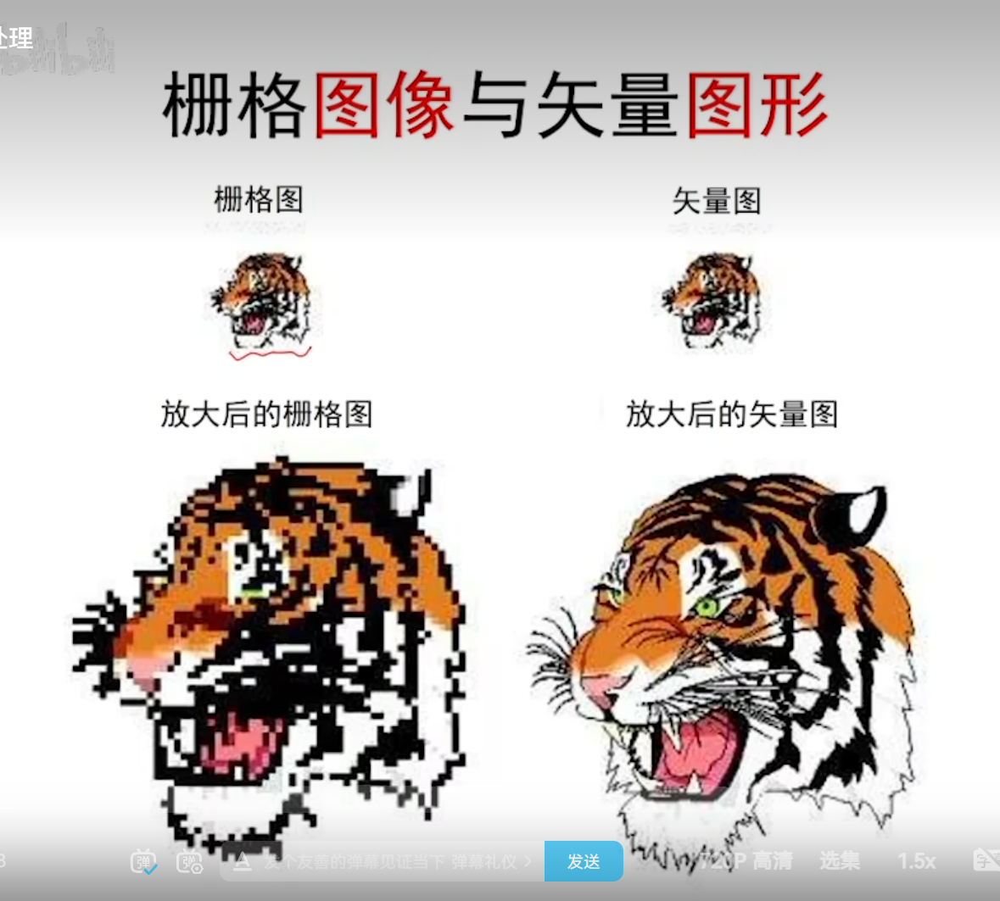

函数拟合：连续建模

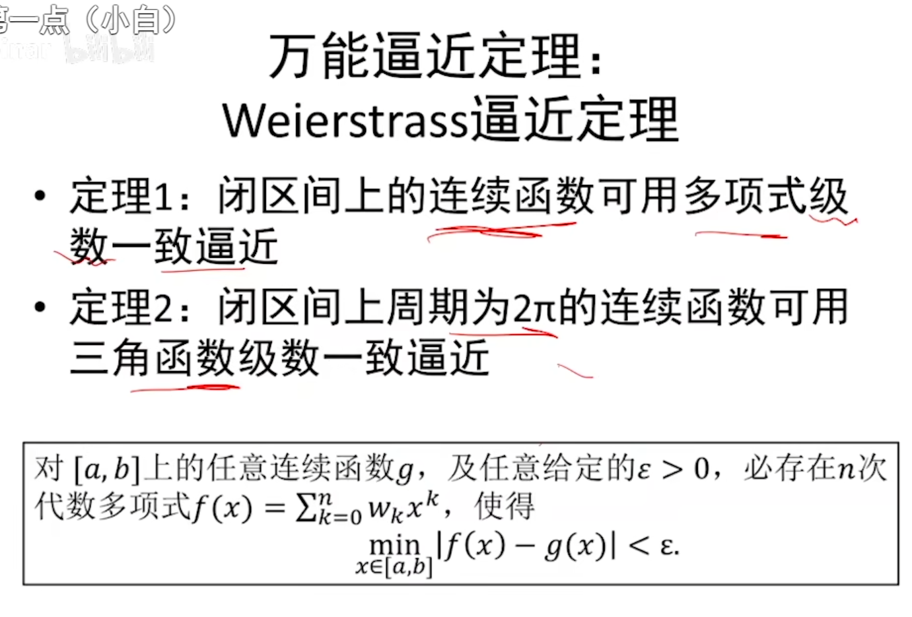

任何一个周期函数都可以写作cos和sin的组合

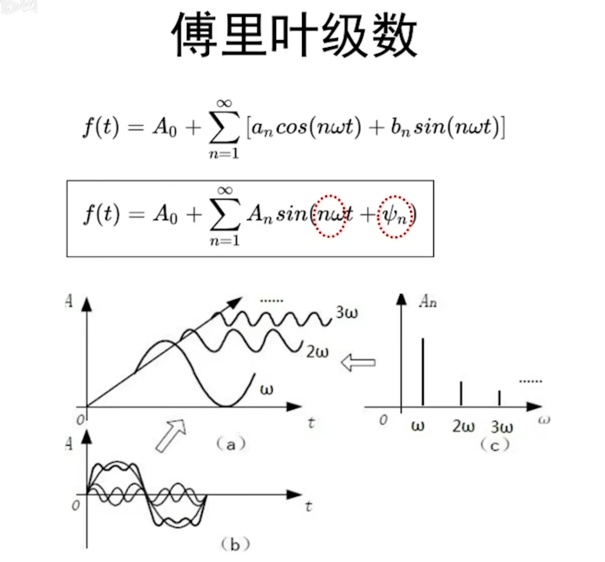

拟合问题（回归问题）

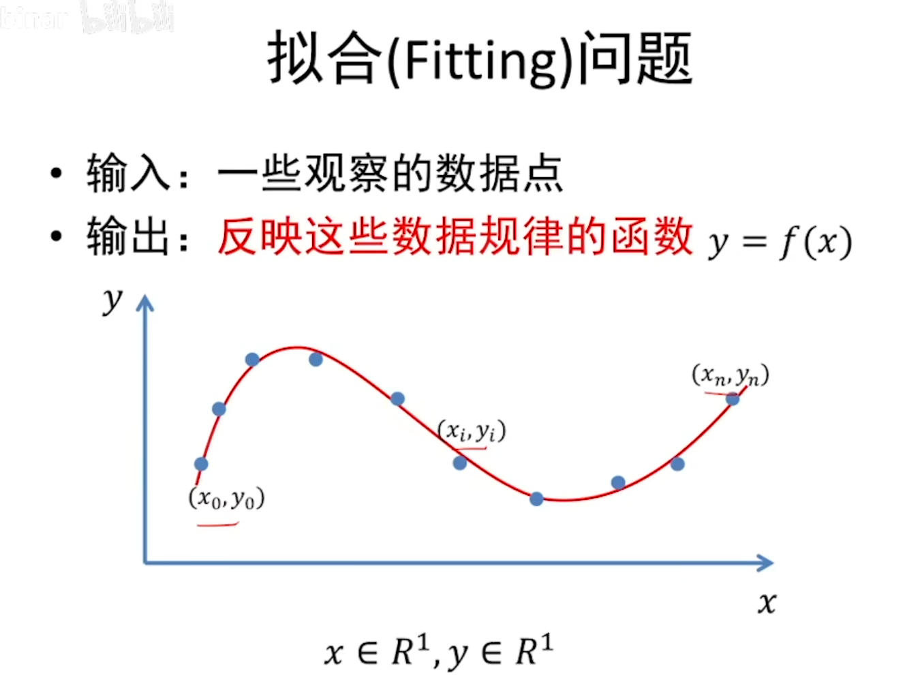

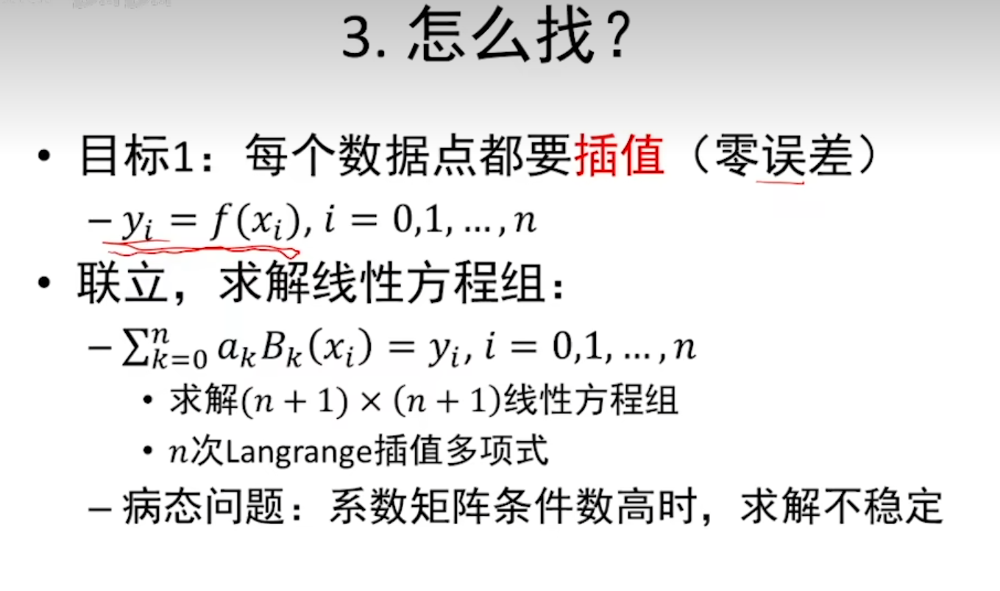

插值：数据点可代入方程

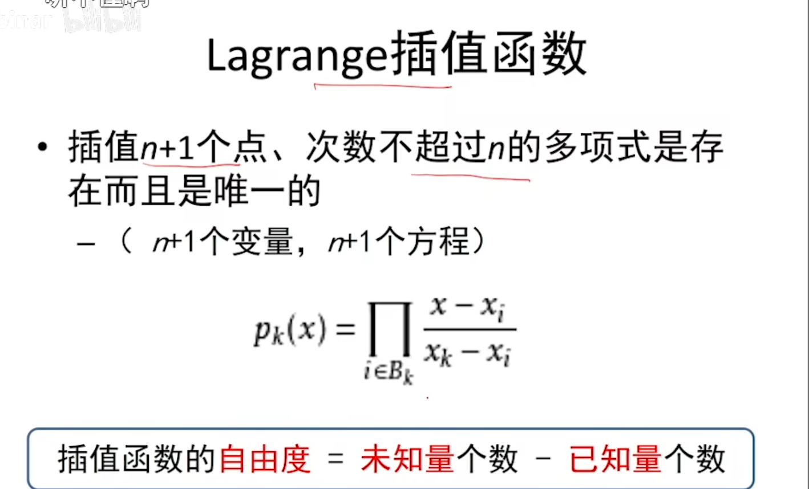

拟合，允许误差

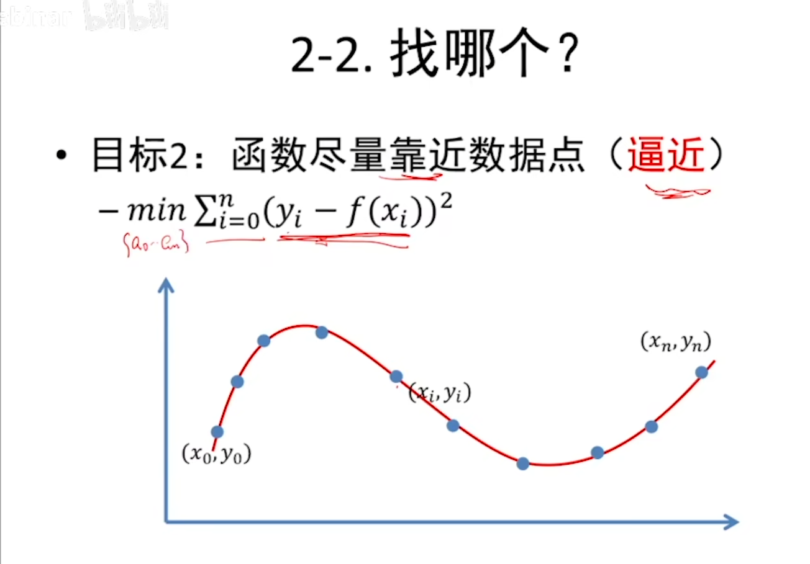

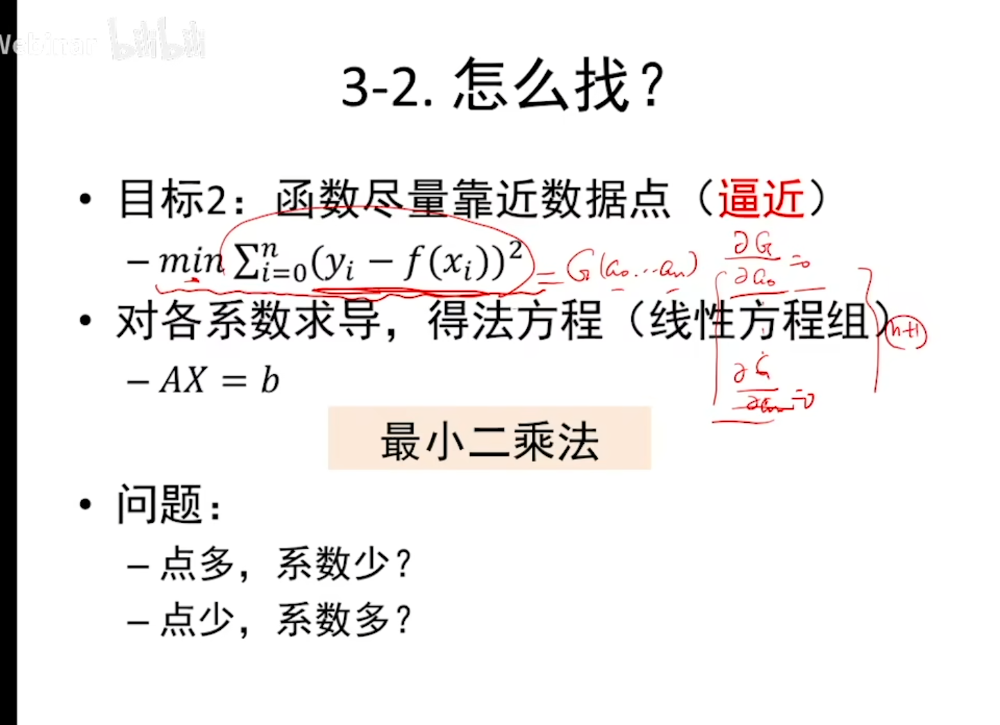

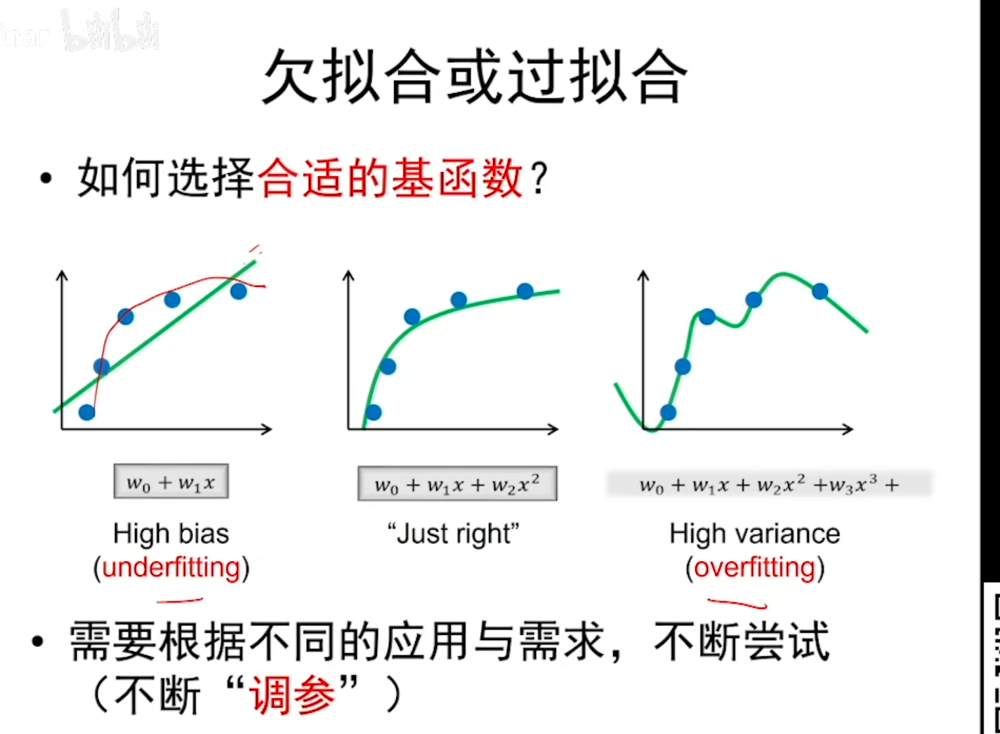

岭回归：稳定拟合

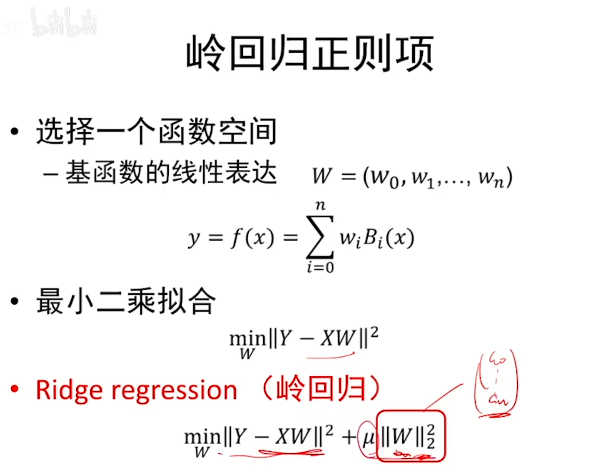

稀疏学习：先找一系列冗余的过拟合函数形成集合，在其中找出能够实现拟合的最小数量的集合。

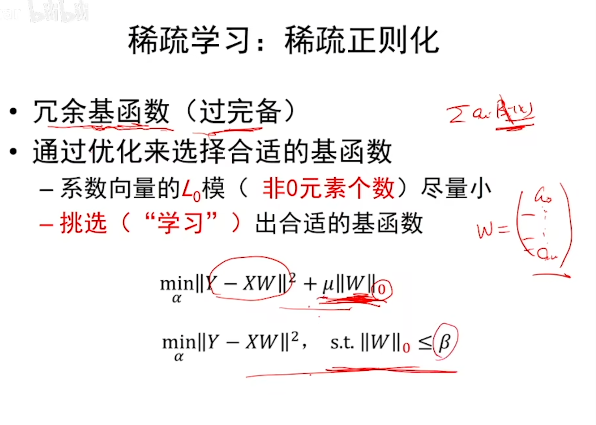

【建议先学完数值分析再看】

